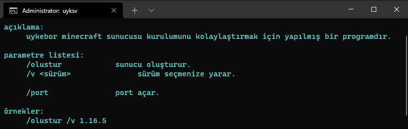

# uyksv
uyksv geliştirilme aşamasında olan bir minecraft sunucu kurma programıdır. her şeyi otomatikleştirmek üzerine dayalıdır.

<h2>log</h2>
<pre>
added help feature /? or /? <parameter>
added create server feature /olustur
added select server version feature ex. /olustur /v <version>
added port forwarding feature /portf <port> //uses ngrok
</pre>

<h2>screenshots</h2>

